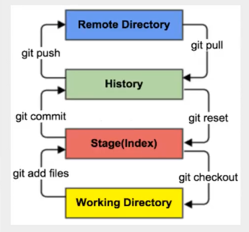
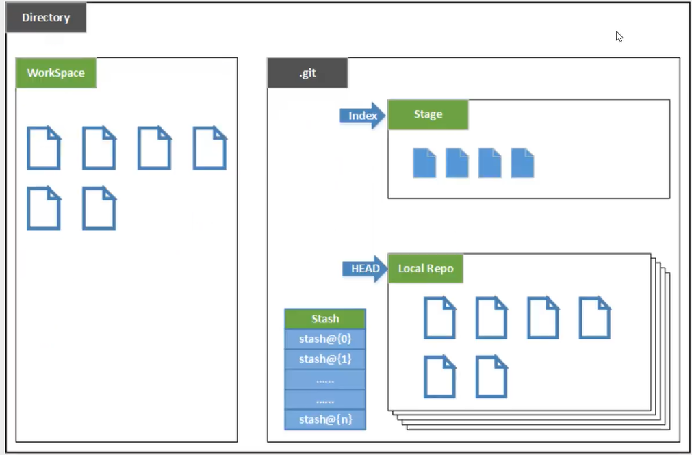

# Git


## Linux基本命令

```bash
cd       #改变目录
cd ..    #回到上一级目录
pwd      #显示当前目录路径
ls       #列出当前目录下的文件
ll       #列出当前目录下的文件(更详细)
touch    #新建一个文件 例如 touch index.js
rm       #删除文件 rm index.js
mkdir    #新建文件夹
rm -r    #删除文件夹 rm -r src
mv       #移动 mv index.html src 
         #将index.html移动到src文件夹下
reset    #重新初始化终端/清屏
clear    #清屏
history  #查看历史命令
help     #帮助
exit     #退出
```


## git配置

### 查看配置命令

```bash
# 显示配置
git config -l

# 显示系统配置
git config --system --list

# 显示用户全局配置
git config --global --list
```


### 必须配置

```bash
# 配置邮箱和名称
git config --global user.name "your name"
git config --global user.email "your email"
```


## git理论

### 原理图






## git创建仓库

* 方式一： 本地初始化仓库

```bash
git init
```

- 方式二： 远程克隆

```bash
git clone [url]
```


## git文件操作

### 文件状态

* Untracked: 未跟踪的,在工作区中，还未加入git库，通过`git add`变成Staged状态
* Unmodify: 文件已入库，未修改，即工作区文件与git库文件保持一致，这种文件有两种去处，如果被修改，变为Modified.如果用`git rm` 移出版本库，则变为Untracted.
* Modified: 文件已被修改。这种文件有两种去处，通过`git add` 变为Staged. 通过`git checkout`变为Unmodify
* Staged: 暂存状态.通过`git commit`提交到库，变为Unmodify.通过`git reset HEAD filename` 取消暂存，变为Modified


