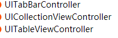
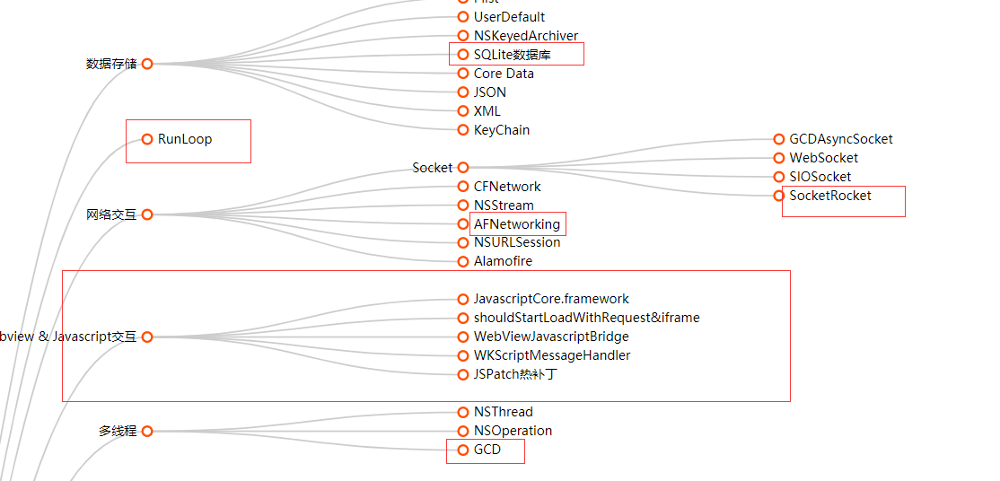
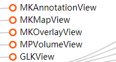

* 注册开发者账户号

* 开发一个简单的app 能够上线apple商城 [ios app开发上线](https://zhuanlan.zhihu.com/p/72380241)

  **重要**

  swift(全部掌握) -- ios基础(**UIview**、**调试**、**UIViewControl、手势**) -- ios高级

* **swift**必学 oc了解  swiftUI不做要求

* UIVIew

* 调试

* UIViewControl

  

* 调试

* 

* **技术栈 ios + H5**

* 

**不重要：：**

* 

  

  