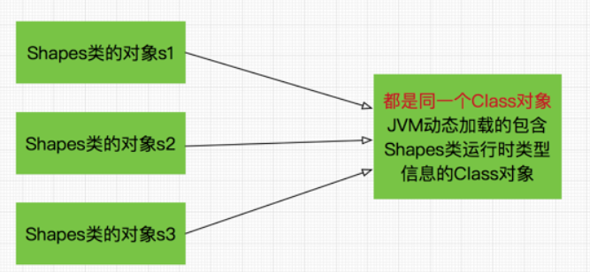
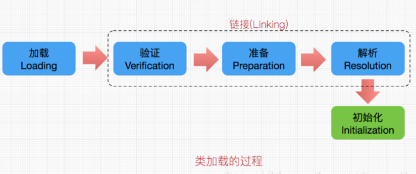

## java内存模型(JMM)

### Java类型信息(Class对象)与反射机制 [URL](https://blog.csdn.net/javazejian/article/details/70768369)

#### Java类型信息(Class对象)

**Java中用来表示运行时类型信息的对应类就是Class类**，Class类也是一个实实在在的类，存在于JDK的java.lang包中.



当我们new一个新对象或者引用静态成员变量时，Java虚拟机(JVM)中的类加载器子系统会将对应Class对象加载到JVM中，然后JVM再**根据这个类型信息相关的Class对象创建我们需要实例对象或者提供静态变量的引用值**。

几点信息：

- Class类也是类的一种，与class关键字是不一样的。
- 手动编写的类被编译后会产生一个Class对象，其表示的是创建的类的类型信息，而且这个Class对象保存在同名.class的文件中(字节码文件)，比如创建一个Shapes类，编译Shapes类后就会创建其包含Shapes类相关类型信息的Class对象，并保存在Shapes.class字节码文件中。
- 每个通过关键字class标识的类，在内存中有且只有一个与之对应的Class对象来描述其类型信息，无论创建多少个实例对象，其依据的都是用一个Class对象。
- Class类只存私有构造函数，因此对应Class对象只能有JVM创建和加载
- Class类的对象作用是运行时提供或获得某个对象的类型信息，这点对于反射技术很重要.

**类加载过程：**



- 加载：类加载过程的一个阶段：通过一个类的完全限定查找此类字节码文件，并利用字节码文件创建一个Class对象
- 链接：验证字节码的安全性和完整性，准备阶段正式为静态域分配存储空间，注意此时只是分配静态成员变量的存储空间，不包含实例成员变量，如果必要的话，解析这个类创建的对其他类的所有引用。
- 初始化：类加载最后阶段，若该类具有超类，则对其进行初始化，执行静态初始化器和静态初始化成员变量。

```java
//字面常量的方式获取Class对象
Class clazz = Gum.class;
```

我们**获取字面常量的Class引用时，触发的应该是加载阶段**，因为在这个阶段Class对象已创建完成，获取其引用并不困难，而无需触发类的最后阶段初始化。

- 获取Class对象引用的方式3种，通过继承自Object类的getClass方法，Class类的静态方法forName以及字面常量的方式”.class”。
- 其中实例类的getClass方法和Class类的静态方法forName都将会触发类的初始化阶段，而字面常量获取Class对象的方式则不会触发初始化。
- 初始化是类加载的最后一个阶段，也就是说完成这个阶段后类也就加载到内存中(Class对象在加载阶段已被创建)，此时可以对类进行各种必要的操作了（如new对象，调用静态成员等），注意在这个阶段，才真正开始执行类中定义的Java程序代码或者字节码。


**关于类加载的初始化阶段，在虚拟机规范严格规定了有且只有5种场景必须对类进行初始化：**

- 使用**new关键字实例化对象**时、读取或者设置一个类的静态字段(不包含编译期常量)以及调用静态方法的时候，必须触发类加载的初始化过程(类加载过程最终阶段)。
- 使用反射包(java.lang.reflect)的方法**对类进行反射调用时**，如果类还没有被初始化，则需先进行初始化，这点对反射很重要。
- 当初始化一个类的时候，如果其**父类**还没进行初始化则需先触发其父类的初始化。
- 当Java虚拟机启动时，用户需要指定一个要执行的**主类**(包含main方法的类)，虚拟机会先初始化这个主类
- 当使用JDK 1.7 的动态语言支持时，如果一个java.lang.invoke.MethodHandle 实例最后解析结果为REF_getStatic、REF_putStatic、REF_invokeStatic的方法句柄，并且这个方法句柄对应类没有初始化时，必须触发其初始化(这点看不懂就算了，这是1.7的新增的动态语言支持，其关键特征是它的类型检查的主体过程是在运行期而不是编译期进行的，这是一个比较大点的话题，这里暂且打住)


#### 反射机制

反射机制是在运行状态中，**对于任意一个类，都能够知道这个类的所有属性和方法；对于任意一个对象，都能够调用它的任意一个方法和属性**，这种动态获取的信息以及动态调用对象的方法的功能称为java语言的反射机制。

**Class类**与**类信息**相关，**Constructor类**表示的是Class 对象所表示的类的构造方法，利用它可以**在运行时动态创建对象**、**Field**表示Class对象所表示的类的成员变量，通过它可以**在运行时动态修改成员变量的属性值**(包含private)、**Method**表示Class对象所表示的类的成员方法，通过它可以**动态调用对象的方法**(包含private)


### Java枚举类型(enum) [URL](https://blog.csdn.net/javazejian/article/details/71333103)

#### 枚举类型的定义

```java
public class EnumDemo {

    public static void main(String[] args){
        //直接引用
        Day day =Day.MONDAY;
    }

}
//定义枚举类型
enum Day {
    MONDAY, TUESDAY, WEDNESDAY,
    THURSDAY, FRIDAY, SATURDAY, SUNDAY
}
```

#### 枚举实现原理

```java
//反编译Day.class
final class Day extends Enum
{
    //编译器为我们添加的静态的values()方法
    public static Day[] values()
    {
        return (Day[])$VALUES.clone();
    }
    //编译器为我们添加的静态的valueOf()方法，注意间接调用了Enum也类的valueOf方法
    public static Day valueOf(String s)
    {
        return (Day)Enum.valueOf(com/zejian/enumdemo/Day, s);
    }
    //私有构造函数
    private Day(String s, int i)
    {
        super(s, i);
    }
     //前面定义的7种枚举实例
    public static final Day MONDAY;
    public static final Day TUESDAY;
    public static final Day WEDNESDAY;
    public static final Day THURSDAY;
    public static final Day FRIDAY;
    public static final Day SATURDAY;
    public static final Day SUNDAY;
    private static final Day $VALUES[];

    static 
    {    
        //实例化枚举实例
        MONDAY = new Day("MONDAY", 0);
        TUESDAY = new Day("TUESDAY", 1);
        WEDNESDAY = new Day("WEDNESDAY", 2);
        THURSDAY = new Day("THURSDAY", 3);
        FRIDAY = new Day("FRIDAY", 4);
        SATURDAY = new Day("SATURDAY", 5);
        SUNDAY = new Day("SUNDAY", 6);
        $VALUES = (new Day[] {
            MONDAY, TUESDAY, WEDNESDAY, THURSDAY, FRIDAY, SATURDAY, SUNDAY
        });
    }
}
```


