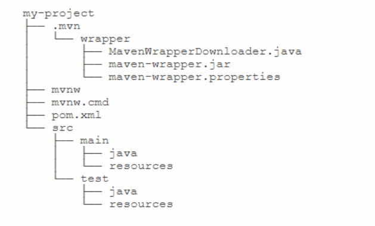

## Maven 重点

### 生命周期

- lifecycle相当于Java的package，它包含一个或多个phase；
- phase相当于Java的class，它包含一个或多个goal；
- goal相当于class的method，它其实才是真正干活的。

大多数情况，我们只要指定phase，就默认执行这些phase默认绑定的goal，只有少数情况，我们可以直接指定运行一个goal，例如，启动Tomcat服务器：

```bash
mvn tomcat:run
```

Maven通过lifecycle、phase和goal来提供标准的构建流程。

最常用的构建命令是指定phase，然后让Maven执行到指定的phase：

- mvn clean
- mvn clean compile
- mvn clean test
- mvn clean package

通常情况，我们总是执行phase默认绑定的goal，因此不必指定goal。


### 插件

[URL](https://www.liaoxuefeng.com/wiki/1252599548343744/1309301217951777)

### 模块管理

可将大项目拆分成几个模块

[URL](https://www.liaoxuefeng.com/wiki/1252599548343744/1309301243117601)

### mvnw

Maven Wrapper就是给一个项目提供一个独立的，指定版本的Maven给它使用。

**安装Maven Wrapper**最简单的方式是在项目的根目录（即`pom.xml`所在的目录）下运行安装命令：

```
mvn -N io.takari:maven:0.7.6:wrapper
```

它会自动使用最新版本的Maven。注意`0.7.6`是Maven Wrapper的版本。最新的Maven Wrapper版本可以去[官方网站](https://github.com/takari/maven-wrapper)查看。

如果要指定使用的Maven版本，使用下面的安装命令指定版本，例如`3.3.3`：

```
mvn -N io.takari:maven:0.7.6:wrapper -Dmaven=3.3.3
```

项目目录：



发现多了`mvnw`、`mvnw.cmd`和`.mvn`目录，我们只需要把`mvn`命令改成`mvnw`就可以使用跟项目关联的Maven。例如：

```
mvnw clean package
```