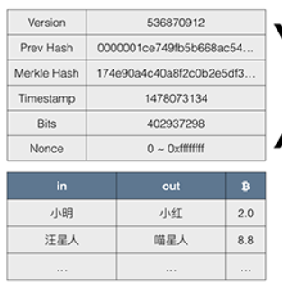
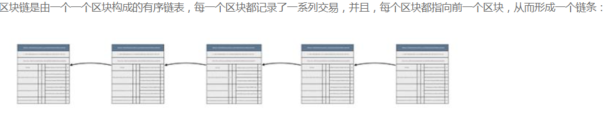
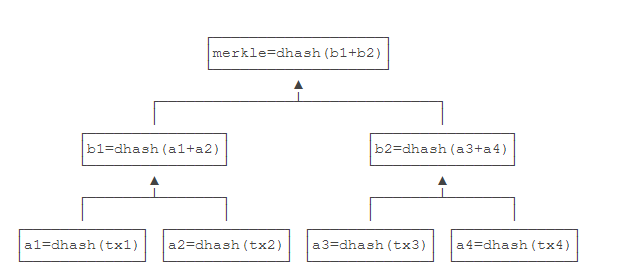
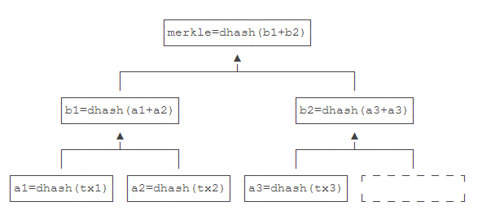
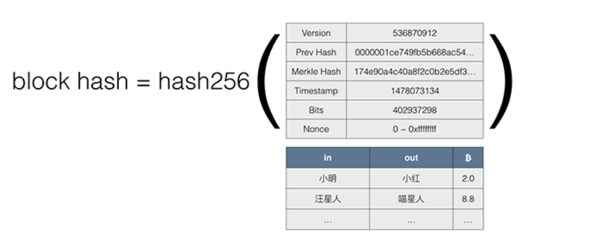

## 区块链学习

### 比特币

* 比特币是第一个基于数学加密原理构建的分布式数字货币系统
* 比特币使用区块链技术实现了数字货币的可信支付
* 创建了无需信任中心的货币发行机制；
* 发行数量由程序决定，无法随意修改；
* 交易账本完全公开可追溯，不可篡改；
* 密码学理论保证货币防伪造，防双花；
* 数字签名机制保证交易完整可信，不可抵赖和撤销。

### 区块链原理

#### 概述

每一个区块中有:

区块链中的主要数据就是一系列交易，第一条交易通常是**Coinbase交易**，也就是矿工的挖矿奖励，后续交易都是**用户的交易**。

比特币使用两种哈希算法，一种是对数据进行**两次SHA-256**计算，这种算法在比特币协议中通常被称为hash256或者dhash。

另一种算法是**先计算SHA-256**，**再计算RipeMD160**，这种算法在比特币协议中通常被称为hash160。

#### **Merkle Hash**

Merkle Hash是把一系列数据的哈希根据一个简单算法变成一个汇总的哈希。

每个tx是一个交易记录

* tx是偶数：

* tx是奇数

从Merkle Hash的计算方法可以得出结论：修改任意一个交易哪怕一个字节，或者交换两个交易的顺序，都会导致Merkle Hash验证失败，也就会导致这个区块本身是无效的，所以，Merkle Hash记录在区块头部，它的作用就是保证交易记录永远无法修改。

#### Block Hash

区块本身用Block Hash——也就是区块哈希来标识。但是，一个区块自己的区块哈希并没有记录在区块头部，而是通过计算区块头部的哈希得到的(**应该是两次hash,图中只写了一次**)：

[例子](https://zhuanlan.zhihu.com/p/33674053)

#### **小结：**

* 区块链依靠安全的哈希算法保证所有区块数据不可更改；

* 交易数据依靠Merkle Hash确保无法修改，整个区块依靠Block Hash确保区块无法修改；

* 工作量证明机制（挖矿）保证修改区块链的难度非常巨大从而无法实现。