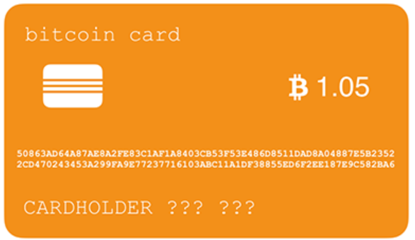

## 区块链学习

### 比特币

* 比特币是第一个基于数学加密原理构建的分布式数字货币系统
* 比特币使用区块链技术实现了数字货币的可信支付
* 创建了无需信任中心的货币发行机制；
* 发行数量由程序决定，无法随意修改；
* 交易账本完全公开可追溯，不可篡改；
* 密码学理论保证货币防伪造，防双花；
* 数字签名机制保证交易完整可信，不可抵赖和撤销。

### 区块链原理

#### 概述

每一个区块中有:

区块链中的主要数据就是一系列交易，第一条交易通常是**Coinbase交易**，也就是矿工的挖矿奖励，后续交易都是**用户的交易**。

比特币使用两种哈希算法，一种是对数据进行**两次SHA-256**计算，这种算法在比特币协议中通常被称为hash256或者dhash。

另一种算法是**先计算SHA-256**，**再计算RipeMD160**，这种算法在比特币协议中通常被称为hash160。

#### **Merkle Hash**

Merkle Hash是把一系列数据的哈希根据一个简单算法变成一个汇总的哈希。

每个tx是一个交易记录

* tx是偶数：

* tx是奇数

从Merkle Hash的计算方法可以得出结论：修改任意一个交易哪怕一个字节，或者交换两个交易的顺序，都会导致Merkle Hash验证失败，也就会导致这个区块本身是无效的，所以，Merkle Hash记录在区块头部，它的作用就是保证交易记录永远无法修改。

#### Block Hash

区块本身用Block Hash——也就是区块哈希来标识。但是，一个区块自己的区块哈希并没有记录在区块头部，而是通过计算区块头部的哈希得到的(**应该是两次hash,图中只写了一次**)：

[例子](https://zhuanlan.zhihu.com/p/33674053)

#### **小结：**

* 区块链依靠安全的哈希算法保证所有区块数据不可更改；
* 交易数据依靠Merkle Hash确保无法修改，整个区块依靠Block Hash确保区块无法修改；
* 工作量证明机制（挖矿）保证修改区块链的难度非常巨大从而无法实现。

### RSA数字签名

#### RSA特点

公钥和密钥都可以加解密--只要能保证**用A加密**，就**用B解密**就行。

#### 传输密文

如果你想把某个消息秘密的发给某人，那你就可以**用他的公钥加密**。因为只有他知道他的私钥，所以这消息也就只有他本人能解开。

#### 证明消息是你发的

可以在你的公告开头或者结尾附上一段**用你的私钥加密**的内容（例如说就是你公告正文的一段话），那所有其他人都可以用你的公钥来解密，看看解出来的内容是不是相符的。如果是的话，那就说明这公告确实是你发的---因为**只有你的公钥才能解开你的私钥加密的内容**，而其他人是拿不到你的私钥的。 

#### 保证消息不被篡改

把你公告的原文做一次**哈希**（md5或者sha1都行），然后**用你的私钥加密这段哈希作为签名**，并一起公布出去。当别人收到你的公告时，他可以用你的公钥解密你的签名，如果解密成功，并且解密出来的哈希值确实和你的公告原文一致。那么他就证明了两点：这消息确实是你发的，而且内容是完整的。

### P2P

#### bitcoin账户

比特币采用的ECDSA签名算法需要一个私钥和公钥组成的秘钥对：私钥本质上就是一个1～2256的随机数，**公钥是由私钥根据ECDSA算法推算出来的**，通过私钥可以很容易推算出公钥，所以不必保存公钥，但是，**通过公钥无法反推私钥，只能暴力破解。** 

如果用银行卡作比较的话，比特币的公钥相当于银行卡卡号，它是两个256位二进制整数

比特币的私钥相当于银行卡密码，它是一个256位二进制整数

#### 小结

比特币使用数字签名保证零信任的可靠P2P交易：

- 私钥是花费比特币的唯一手段；
- 钱包软件是用来帮助用户管理私钥；
- 所有交易被记录在区块链中，可以通过公钥查询所有交易信息。