## UML

### 类图

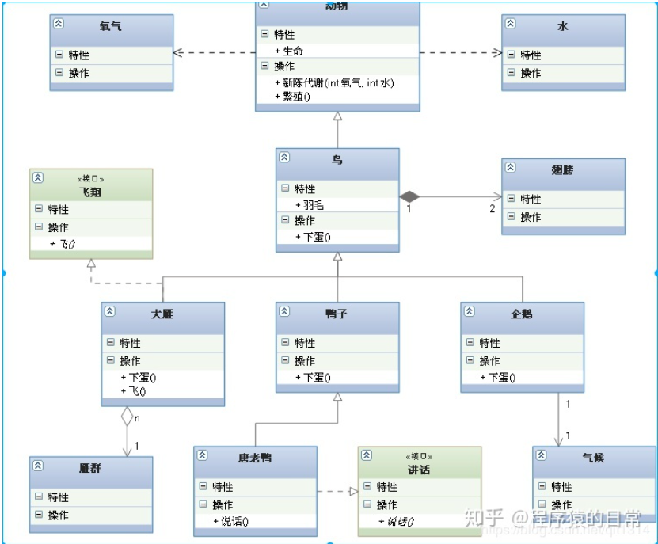

* 视图

  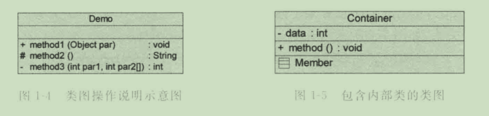

* 类关系

  >* 单向关联
  >
  >  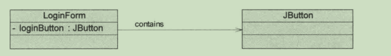
  >
  >* 双向关联
  >
  >  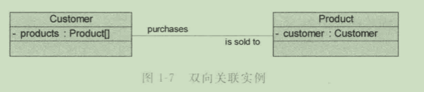
  >
  >* 自关联
  >
  >  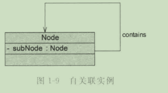
  >
  >* 多重关联
  >
  >  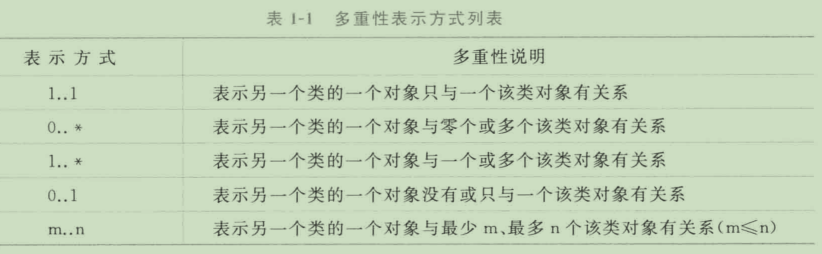
  >
  >  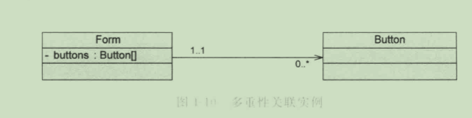
  >
  >* 聚合关系(成员类可以独立存在)
  >
  >  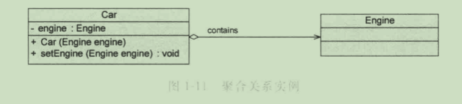
  >
  >* 组合关系(同生共死)
  >
  >  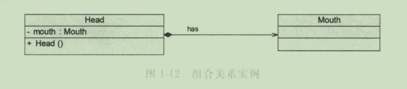
  >
  >* 依赖关系(某个类方法需要另一个类对象作为参数)
  >
  >  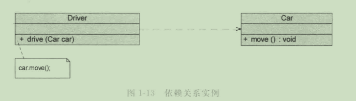
  >
  >* 泛化关系(继承)
  >
  >  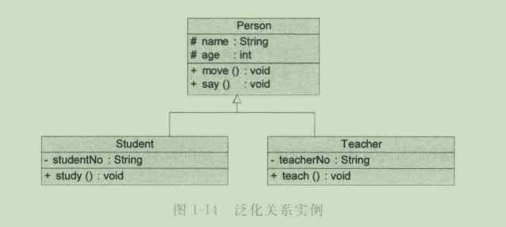
  >
  >* 接口与实现关系
  >
  >  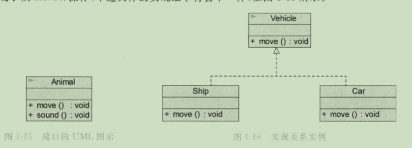

### 面向对象设计原则

* 单一职责原则

  > 类的职责要单一，不能将太多的职责放在同一个类中

* 开闭原则

  > 软件实体对扩展是开放的，但对修改是关闭的，即在不修改一个软件实体的基础上去扩展其功能。

* 里氏代换原则

  > 在软件系统中，一个可以接受基类对象的地方必然可以接受一个子类对象

* 依赖倒转原则

  > 要针对抽象层编程，而不要针对具体类编程(要针对接口编程，不要针对实现编程)

* 接口隔离原则

  > 使用多个专门的接口来取代一个统一的接口

* 合成复用原则

  > 在复用功能时，应该尽量多使用组合和聚合关联关系，尽量少使用甚至不使用继承关系

* 迪米特法则

  > 一个软件实体对于其他实体的引用越少越好，或者说如果两个类不必彼此直接通信，那么这两个类就不应该发生直接的相互作用，而是通过引入一个第三者发生间接交互。

