### 编译/链接过程

* 编译系统

  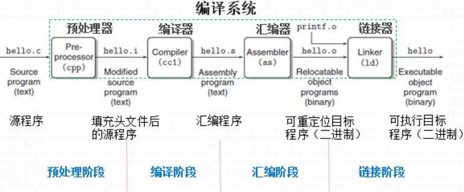

### 一个典型系统的计算机组成

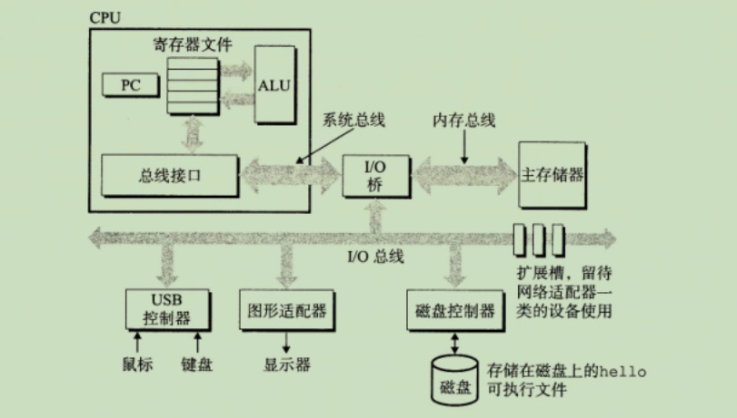

### 运行hello程序

* 读取hello命令，并将其存放到内存中

  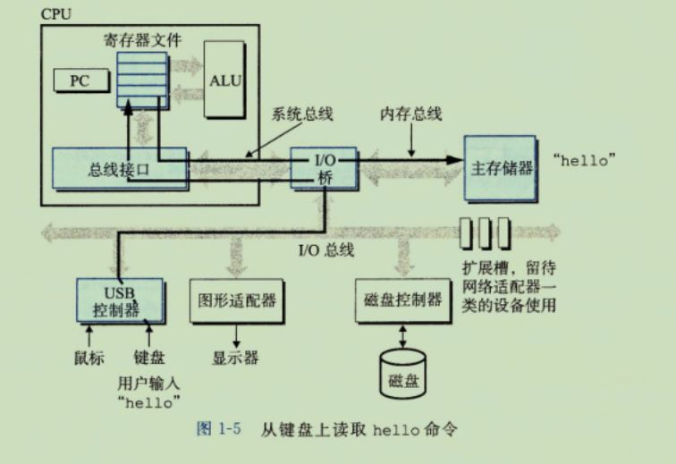

* 数据(代码)加载

  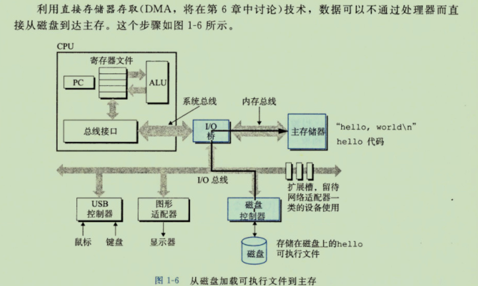

* 输出显示

  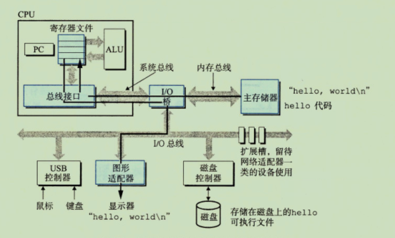

### 存储设备的层次结构

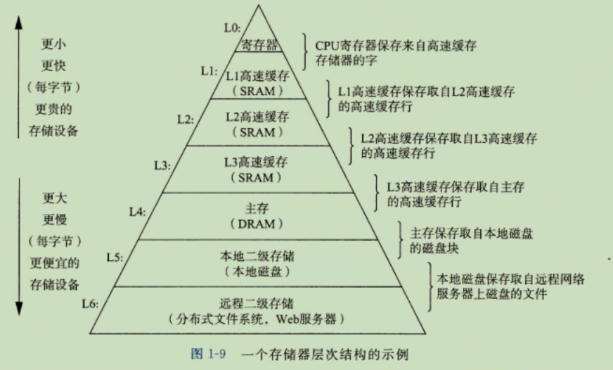

### 操作系统的管理硬件

* 计算机系统的分层视图

  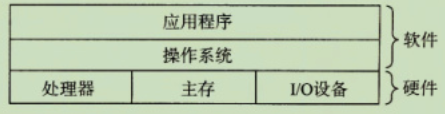

* 操作系统提供的抽象表示

  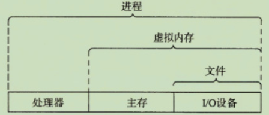

* 进程

  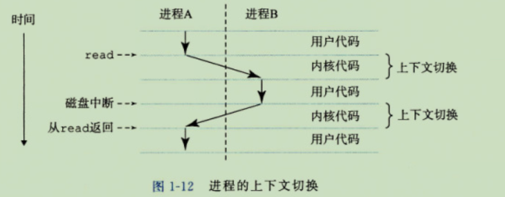

* 虚拟内存

  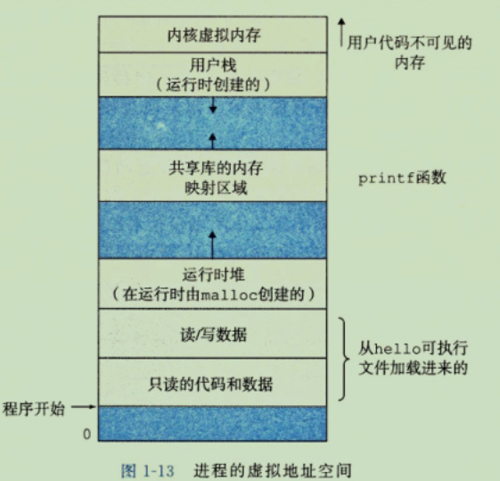

### 更高层次的抽象

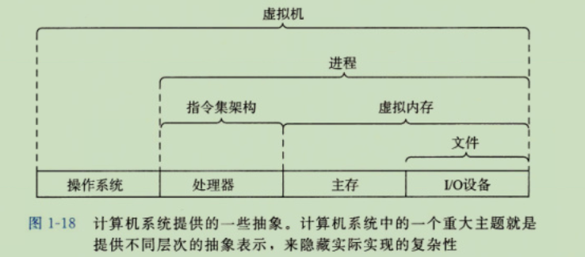

