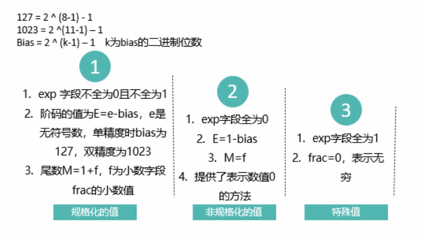

### 数据类型与字节的对应关系

| C DataType | Typical32-bit | Typical64-bit | x86-64 |
| ---------- | ------------- | ------------- | ------ |
| char       | 1             | 1             | 1      |
| short      | 2             | 2             | 2      |
| int        | 4             | 4             | 4      |
| long       | 4             | 8             | 8      |
| float      | 4             | 4             | 4      |
| double     | 8             | 8             | 8      |
| longdouble | −             | −             | 10/16  |
| pointer    | 4             | 8             | 8      |

### 寻址和字节顺序

* 大端法： Sun, PPC Mac, Internet 最高有效字节在前面

* 小端法：x86 最低有效字节在前面

* 双端法：将处理器配置成小端或大端两种的机器运行。

### 位级运算

* 布尔代数

  

* 按位的布尔运算

  

### 逻辑运算

非零为true，0为false

### 整数表示

补码表示 不再赘述

### 类型转换

* 长度相同

  **强制类型转换结果保持位值不变，只是改变了解释这些位的方式。**

* 长->短

  **系统把多余的高位字长部分直接截断，低位直接赋值，也是一种保持位值的处理方法。**

* 短->长

  **不仅是相应的位值相等，高位部分还会扩展为原数字的符号位。**

### 整数运算

原理不赘述 **注意溢出问题**

### 浮点数

**IEEE浮点表示**

* 数值

  

* 编码

  

* 类型

  

  

  

* 舍入

  向偶数舍入有两个原则，一是**向最接近的值舍入**，再一个是**当处在"中间值"时看有效数值是否是偶数，如果是偶数则直接舍去不进位，如果是奇数则进位**。
  
  

### 浮点运算

### C语言中浮点数的转换问题

* int转换为float，不会溢出，可能被舍入；

* int或float转换为double，能够准确表示；

* double转换为float，可能会溢出+∞或- ∞，也可能会舍入；

* float或double转换为int，可能会溢出，如果需要舍入则是向零舍入。